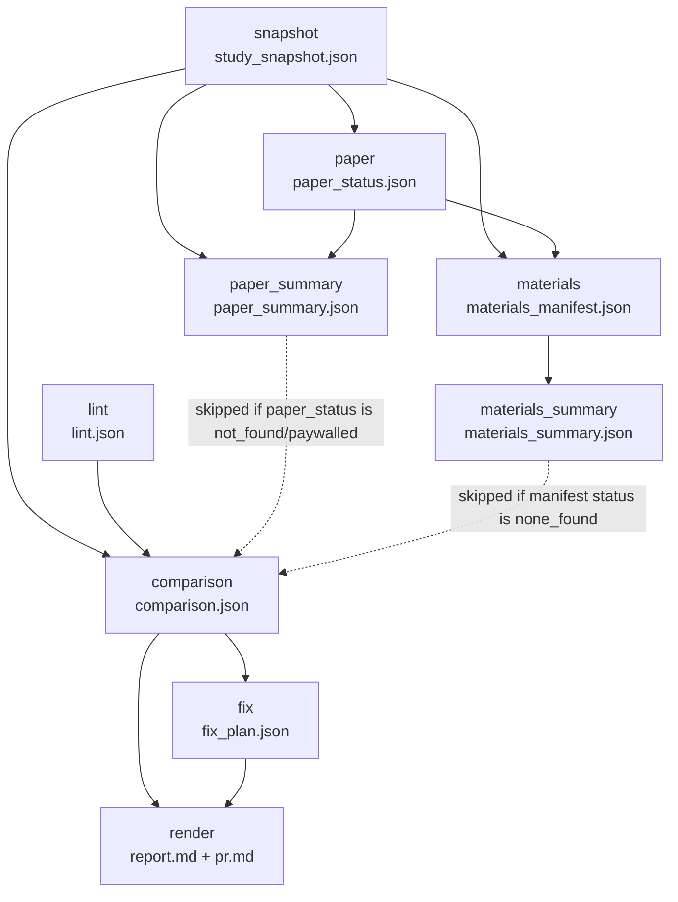

# Pipeline

This document describes the nine-stage `coggym_check` pipeline: what each
stage reads and writes, when a stage is skipped, what happens when a stage
fails, and how resuming an in-progress run works. Stage names, order, and
inter-stage dependencies below are taken verbatim from the authoritative
registry, `STAGE_REGISTRY` in
[`src/coggym_check/rundir.py`](../src/coggym_check/rundir.py). Orchestration
semantics (what decides to run/skip a stage, and in what order) are owned by
[`.claude/skills/check-study/SKILL.md`](../.claude/skills/check-study/SKILL.md)
for interactive runs and `src/coggym_check/headless.py` for `python -m
coggym_check run`; this document mirrors both and must not contradict either.

## Stage diagram

Solid arrows are hard dependencies (`STAGE_REGISTRY[stage].inputs`). Dashed
arrows into `comparison` mark stages that may legitimately be skipped
upstream — `comparison` still runs and reports the resulting degraded
coverage rather than being skipped itself.

## Stage table

`Producer` names either the plain-Python function/CLI subcommand that does
the work, or the `.claude/agents/*.md` subagent (with its model) that does
it — several stages are a Python step plus an agent step, listed in the
order they actually run.

| Stage | Producer | Inputs | Artifact | Skip condition |
|---|---|---|---|---|
| `snapshot` | Python `dataset.load_study` (CLI `snapshot`) | — | `study_snapshot.json` | Never skipped. `StudyNotFoundError` is fatal for the whole study/run. |
| `lint` | Python `lint.lint_study` (CLI `lint`) | — | `lint.json` | Never skipped. Error-level findings are non-fatal data, not an exception. |
| `paper` | Python `paper.extract_paper` (CLI `extract-paper`); falls back to the `paper-finder` agent (sonnet) if `status: not_found` | `snapshot` | `paper_status.json` | Never skipped — the agent fallback only fires on `not_found`, it doesn't skip the stage. |
| `materials` | `materials-scout` agent (sonnet) writes the manifest, then Python `materials.download_manifest` (CLI `download`) back-fills it | `snapshot`, `paper` | `materials_manifest.json` | Never skipped. |
| `paper_summary` | `paper-analyst` agent (opus) | `snapshot`, `paper` | `paper_summary.json` | Skipped if `paper_status.json`'s `status` is `not_found` or `paywalled` — no paper text exists to read. |
| `materials_summary` | `materials-analyst` agent (sonnet) | `materials` | `materials_summary.json` | Skipped if `materials_manifest.json`'s `status` is `none_found` — nothing was downloaded to mine. |
| `comparison` | `structure-comparator` agent (opus) | `snapshot`, `lint`, `paper_summary`, `materials_summary` | `comparison.json` | Never skipped, even if both `paper_summary` and `materials_summary` were skipped — it reports the resulting degraded `coverage.paper`/`coverage.materials` instead. |
| `fix` | `fix-drafter` agent (sonnet) writes `fix_plan.json`, then runs `apply-fixes` (CLI) itself | `comparison` | `fix_plan.json` | No skip rule. An empty `fix_plan.fixes` list is a legitimate zero-fix outcome (`apply-fixes` writes nothing, creates no branch, exits 0), not a skip. |
| `render` | `fix-drafter` agent runs `render` (CLI) itself, in the same invocation as `fix` | `comparison`, `fix` | `report.md` (+ `pr.md`, not schema-tracked) | No skip rule; renders from `comparison.json` alone if `fix_plan.json`/`paper_status.json`/`materials_manifest.json` are absent, noting them as "not available". |

## Failure-mode matrix

| Condition | Behavior |
|---|---|
| Study doesn't exist in the datasets repo | `snapshot` raises `StudyNotFoundError` — **fatal**. Interactive orchestration stops the whole run (SKILL.md step 3a/4); headless `run` catches this per-study as `StudyFatalError`, records it as that study's error, and continues to the next study in a `--studies-from` batch. |
| `paper.pdf` not present under `studies/<study>/` or `materials/<study>/` | `extract-paper` writes `paper_status.json` with `status: not_found` (exit 1) and does not touch the network. The `paper-finder` agent (sonnet) then runs to find an open-access copy online. |
| `paper.pdf` present but corrupt/encrypted/unreadable | `paper.extract_paper` catches `pymupdf.FileDataError`/`EmptyFileError`, cleans up any partial `paper_text/` output, and returns a structured `status: not_found` with a note — never crashes. |
| Paper found but paywalled (no open-access copy locatable) | `paper-finder` leaves `paper_status.json` with `status: paywalled`. `paper_summary` is then skipped; `comparison` proceeds with degraded paper coverage. |
| `materials-scout` finds no author-released materials | `materials_manifest.json`'s `status` is `none_found`. `materials_summary` is then skipped; `comparison` proceeds with degraded materials coverage. |
| Hostile/traversal OSF file or folder names (e.g. containing `../`, absolute paths, null bytes) | `materials.py`'s `_is_safe_path_segment` (layer 1) rejects the individual entry before any write; `_download_within_cap` (layer 2) additionally resolves every destination path and refuses to write outside the materials directory, raising `_PathEscapeError` if that guard is ever reached. The offending source is marked `failed` with a note rather than written anywhere. |
| `apply-fixes` run with no `lint.json` in the run dir | Refuses immediately (exit 1, no worktree/branch created) — there is no pre-fix lint baseline to regression-check against. Run `lint` first. |
| A fix introduces a new lint `error`-level finding (regression) | `apply-fixes` deletes the fix branch and the worktree, and exits 1 — the branch never persists half-broken. |
| `fix/<study>-structure` branch already exists | `apply-fixes` refuses (exit 1) unless `--force-branch`, which deletes and recreates it. |
| Any successful fix branch | Created **locally only**, in the `cog-gym-datasets` clone, via a `git worktree` — `apply-fixes` never runs `git push` (grep the module: it doesn't appear). Pushing is always a manual, human step (see the README's "Submitting the PR yourself"). |
| `claude` binary missing/unspawnable during a headless agentic stage | `run_agentic_stage`/`run_fix_and_render_stage` catch `OSError`/`SubprocessError`, record the stage(s) `failed` with a `skipped_reason` note, and the batch continues — to the next stage, and to the next study in a multi-study run. |

## Resumability semantics

`rundir.stage_status(run_dir)` computes each registered stage's status as one
of `done`, `stale`, `missing`, `skipped`, or `failed`, per artifact:

1. **Artifact missing.** If `run_meta.json` has a record for the stage with
   `status: skipped` or `status: failed`, that status is reported; otherwise
   `missing`.
2. **Artifact present but fails schema validation.** Reported as `missing`
   (not a new status) plus a stderr warning — a corrupt-but-present file is
   more suspicious than an absent one, but the caller's action is the same
   either way: (re)run the stage.
3. **Artifact-first rule.** If the artifact is present and valid, and either
   the stage has no declared inputs or no `run_meta.json` record exists yet
   for it, the stage is `done` — hash comparison only ever happens once a
   record exists to compare against, so a stage can be `stale` only after at
   least one `record_stage` call for it.
4. **Otherwise** (artifact valid, record exists, stage has inputs): `done` if
   every input's current content hash matches what was recorded at
   `record_stage` time, else `stale`.

**Skipped-shows-as-missing caveat (interactive orchestration only).** Under
the interactive `/check-study` skill, a skip (`paper_summary` on
`not_found`/`paywalled`, `materials_summary` on `none_found`) is never
written to `run_meta.json` — SKILL.md is explicit that "no CLI call records
this; `record-stage` is Python-internal only and has no CLI entry point";
the skipped artifact's absence plus the orchestrator's note in its final
message *is* the record. Consequently `init-run`'s table reports a
skipped-in-this-sense stage as plain `missing`, and re-deriving the skip
decision (by re-reading `paper_status.json`/`materials_manifest.json`) is
what stops a plain re-run from re-attempting it — a `missing`
`paper_summary`/`materials_summary` is therefore not necessarily pending
work. Under headless `run` (`headless.py`), by contrast, the skip *is*
recorded (`rundir.record_stage(run_dir, stage, "skipped", skipped_reason=...)`
is called directly, being ordinary in-process Python, not a CLI
invocation), so `init-run`'s table genuinely shows `skipped` for those runs.

## Agent model assignments

| Agent | Model | Stage |
|---|---|---|
| `paper-finder` | sonnet | `paper` (fallback only, when `extract-paper` reports `not_found`) |
| `materials-scout` | sonnet | `materials` |
| `paper-analyst` | opus | `paper_summary` |
| `materials-analyst` | sonnet | `materials_summary` |
| `structure-comparator` | opus | `comparison` |
| `fix-drafter` | sonnet | `fix` + `render` (one invocation covers both) |

The opus assignments (`paper-analyst`, `structure-comparator`) are the two
stages doing the heaviest judgment work — extracting full paper structure
and applying the fix-conservatism/severity policy field-by-field — everything
else runs on sonnet.
